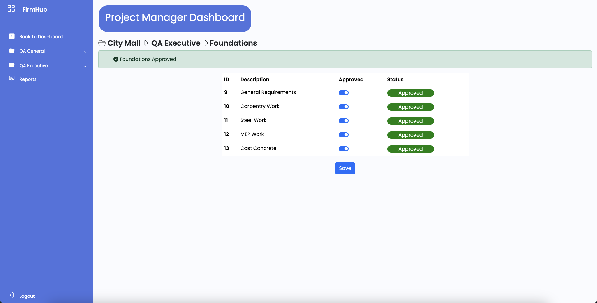

<!-- PROJECT LOGO -->
 

  

  <h3 align="center">FirmHub</h3>

  

    Your gateway to professional managment
     
    <a href="https://github.com/Zughayyar/Python_Project_MyPMS"><strong>Explore the docs »</strong></a>
     
     
    <a href="https://github.com/Zughayyar/Python_Project_MyPMS">View Demo</a>
  

<!-- TABLE OF CONTENTS -->

  
Table of Contents

  <ol>
    <li>
      <a href="#about-the-project">About The Project</a>
      <ul>
        <li><a href="#built-with">Built With</a></li>
      </ul>
    </li>
    <li><a href="#contributing">Contributing</a></li>
    <li><a href="#contact">Contact</a></li>
  </ol>

<!-- ABOUT THE PROJECT -->
## About The Project

(<a href="#readme-top">back to top</a>)

### Built With

This section should list any major frameworks/libraries used to bootstrap your project. Leave any add-ons/plugins for the acknowledgements section. Here are a few examples.

* [![Bootstrap][Bootstrap.com]][Bootstrap-url]
* [![JQuery][JQuery.com]][JQuery-url]

(<a href="#readme-top">back to top</a>)

<!-- LICENSE -->
## License

Distributed under the MIT License. See `LICENSE.txt` for more information.

(<a href="#readme-top">back to top</a>)

<!-- CONTACT -->
## Contact

Your Name -  Anas Zughayayr - https://github.com/Zughayyar

Project Link: https://github.com/Zughayyar/Python_Project_MyPMS.git

(<a href="#readme-top">back to top</a>)
